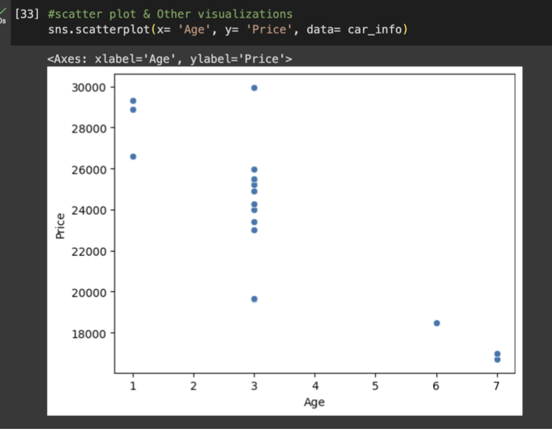
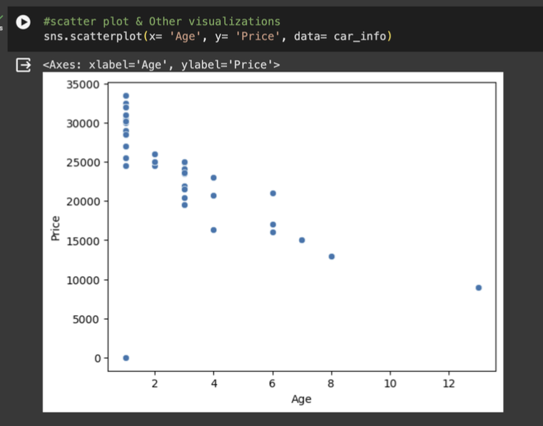
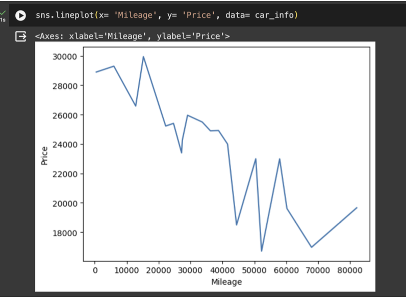
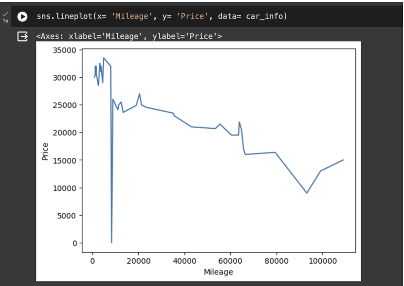

# Car Model Price Analysis: Nissan Rogue SV

## Overview
This analysis focuses on the pricing of the **Nissan Rogue SV** in two cities: **Boston** and **San Jose**. The study examines how car prices relate to age, mileage, and depreciation, while also estimating the price of a 3-year-old model in each city.

## Objective
The goal of this project was to:
- Compare car prices, age, and mileage across two cities.
- Calculate depreciation and recommend a price for a 3-year-old Nissan Rogue SV.

## Methodology

### Data Collection & Processing
- Collected data for the **Nissan Rogue SV** in Boston and San Jose, including **price**, **age**, and **mileage**.
- Calculated the **age of the car** as:  
  `Current Year - Manufacturing Year`

### Data Analysis
- Generated **scatter plots** to visualize the relationship between car age and price.
- Created **line plots** to visualize the relationship between mileage and price.
- Calculated the **average price** for the Nissan Rogue SV in both cities.

### Depreciation Calculation
- Used **linear regression** to model the relationship between car age (independent variable) and price (dependent variable).
- Estimated the **depreciation rate** based on the linear regression model.

### Recommended Price Calculation
- Using the depreciation rates, the estimated recommended price for a **3-year-old Nissan Rogue SV** was calculated for both cities.

## Results

- **Average Price**
  - Boston: $23,789.3
  - San Jose: $24,902.54

- **Depreciation**
  - Boston: $1,899.28/year
  - San Jose: $1,833.37/year

- **Recommended Price for a 3-Year-Old Car**
  - Boston: $24,264.13
  - San Jose: $23,906.83

## Visualizations

Here are some key visualizations generated during the analysis:

1. **Scatter Plot of Age vs. Price (Boston)**  
   

2. **Scatter Plot of Age vs. Price (San Jose)**  
   

3. **Line Plot of Mileage vs. Price (Boston)**  
   

4. **Line Plot of Mileage vs. Price (San Jose)**  
   

## Conclusion

This analysis demonstrates that car prices decrease with increasing mileage and age, with a few outliers. The depreciation rates are quite similar across both cities, and the recommended prices for a 3-year-old Nissan Rogue SV are nearly the same.
